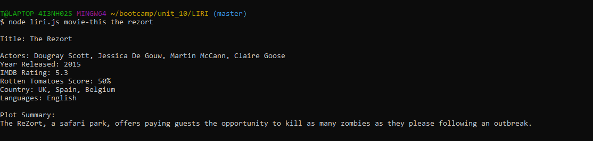
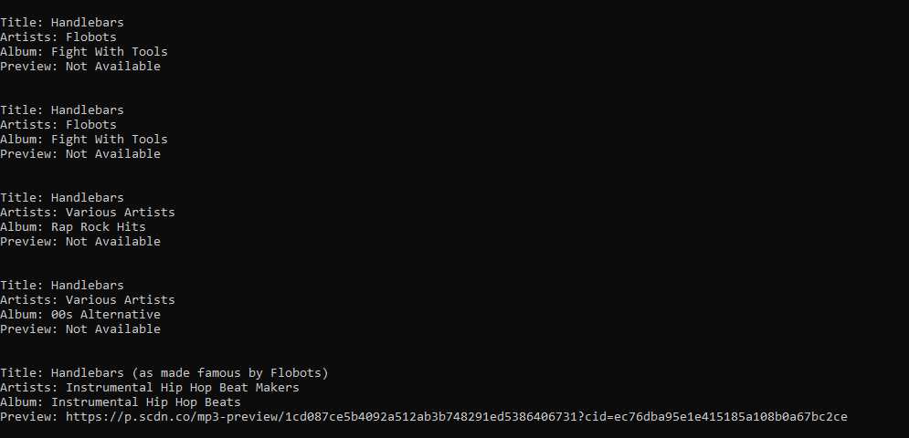
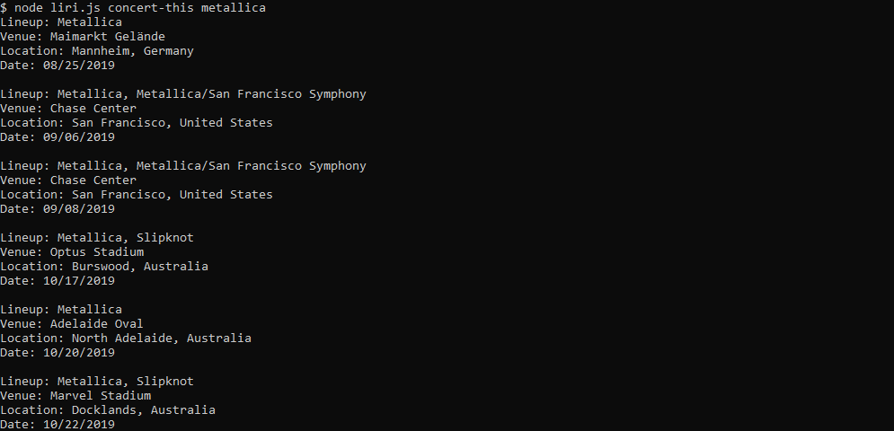

# liri-node-app


Command line media search app for movies, songs and concerts

[Features](#features) | [Usage](#usage) | [Examples](#examples) | [Configuration](#configuration)

# features

LIRI-Bot supports four search types:
 - [Music](#music-search)
 - [Concert](#concert-search)
 - [Movie](#movie-search)
 - [Automated or simon-says](#automated-search)
 
 and returns the results directly to your screen in a pleasing easy-to-read format. 
 

# usage
`liri-bot` music search requires two arguments. The first species the type of search. The search commands for the following types are:
-  `spotify-this` for song or artist searches
-  `concert-this` for concerts by a specific artist
- `movie-this` for movie title searches
- `simon-says` for automated searches

### search format
```sh
$ node liri.js [searchType] [query]
```
## examples

### music search
```sh
$ node liri.js spotify-this flobots handlebars
```
#### results
Music search will return all tracks results that match the query terms.  For each result it will include:
- the track title
- artist
- the album
- a link to the preview if there is one available
##### example


### concert search
```sh
$ node liri.js concert-this metallica
```
#### results
Concert searches will return all event results that match the query terms.  For each result it will include:
- the artist lineup
- the venue
- the location
- the date or dates that it occurs
##### example

### movie search
```sh
$ node liri.js movie-this metallica
```
#### results
Movie searches will return a single movie result that matches the query term.  The result will include:
- movie title
- featured actors
- release year
- IMDB rating
- Rotten Tomatoes Score
- the location it was filmed
- languages
- a plot summary

##### example
```sh
Title: The Rezort

Actors: Dougray Scott, Jessica De Gouw, Martin McCann, Claire Goose
Year Released: 2015
IMDB Rating: 5.3
Rotten Tomatoes Score: 50%
Country: UK, Spain, Belgium
Languages: English

Plot Summary:
The ReZort, a safari park, offers paying guests the opportunity to kill as many zombies as they please following an outbreak
```
### automated search
This search does not require a query term but will automatically read the search type and query from a text file.  The default file is random.txt. 
```sh
$ node liri.js simon-says
```
#### results
Results will vary depending on the type of search used and query

# configuration
In order to use this a .env file must be created with the following:  
```sh
SPOTIFY_ID=[Your Spotify ID]
SPOTIFY_SECRET=[Your Spotify secret]

#OMDB API key

OMDB_KEY=[Your OMDB key]

#Bandsintown

APP_ID=[Your app ID]
```
# author
Tierra Farris

# license

MIT